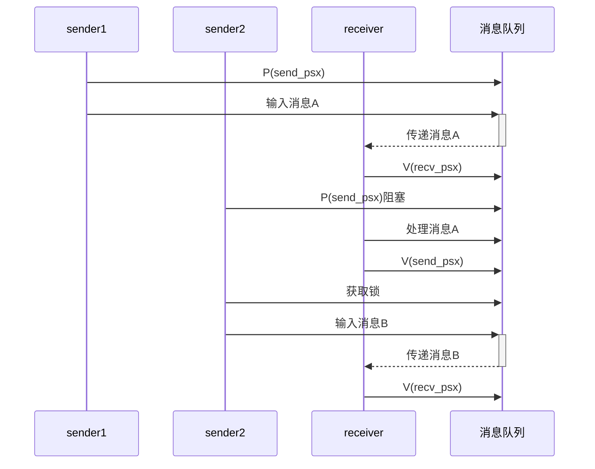
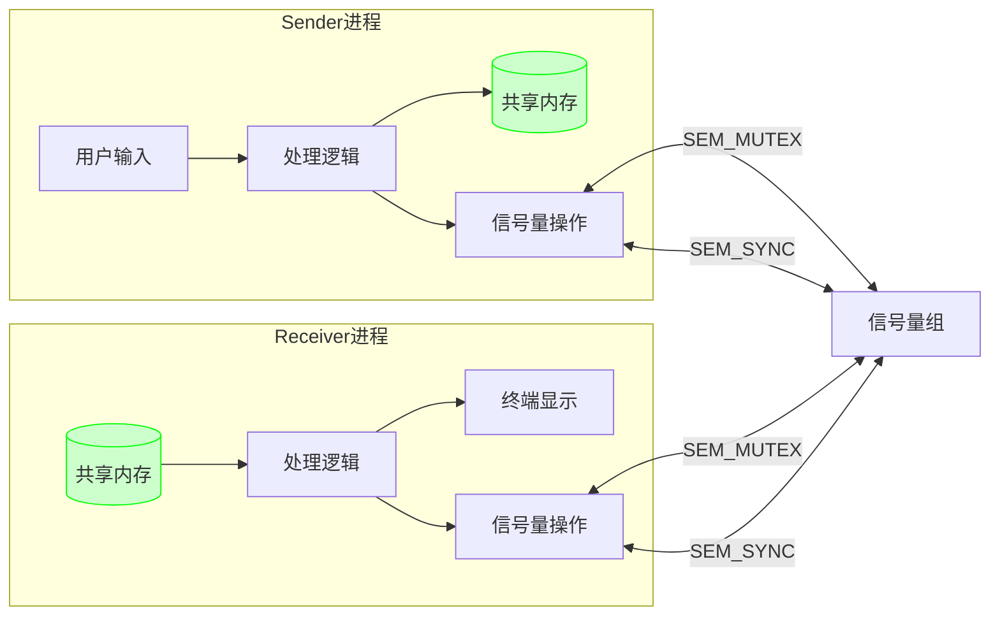

# 1.设计目的
(1)通过对Linux 进程控制的相关系统调用的编程应用，进一步加深对进程概念的理解，明确进程和程序的联系与区别，理解进程并发执行的具体含义。
(2)通过Linux管道通信机制、消息队列通信机制、共享内存通信机制的应用，加深对不同类型的进程通信方式的理解。
(3)通过对 Linux 的 POSIX 信号量及 IPC 信号量的应用,加深对信号量同步机制的理解。
(4)请根据自身情况，进一步阅读分析相关系统调用的内核源码实现。
# 2.设计要求
### 模拟shell
#### 实验要求
```
编写三个不同的程序cmd1.c、cmd2.c及cmd3.c，每个程序的功能自定，分别编译成可执行文件cmd1、cmd2及cmd3。然后再编写一个程序，模拟shell 程序的功能:能根据用户输入的字符串(表示相应的命令名)，为相应的命令创建子进程并让它去执行相应的程序而父进程则等待子进程结束，然后再等待接收下一条命令。如果接收到的命令为exit，则父进程结束，退出模拟 shell; 如果接收到的命令是无效命令,则显示“Command not found”继续等待输入下一条命令。
```
**cmd1**
```
#include <stdio.h>
int main()
{
    printf("[*] Hello world! I'm cmd1.\n");
    return 0;
}
```
**cmd2**
```
#include <stdio.h>
int main()
{
    printf("[*] Hello world! I'm cmd3.\n");
    return 0;
}
```
**cmd3**
```
#include <stdio.h>
int main()
{
    printf("[*] Hello world! I'm cmd3.\n");
    return 0;
}
```

---

**shell**
```
#include <stdio.h>
#include <unistd.h>
#include <stdlib.h>
#include <string.h>
#include <sys/wait.h>

#define MAX_CMD_LEN 128  // 最大命令长度
#define PROMPT "mysh> "  // 提示符样式
void execute_command(const char *cmd) {
    pid_t pid = fork();
    if (pid < 0) {
        perror("fork失败");
        return;
    } else if (pid == 0) {
        // 子进程执行命令（自动添加./前缀）
        execlp(cmd, cmd, (char*)NULL);  // 使用execlp自动搜索PATH

        perror("执行失败");
        exit(EXIT_FAILURE);
    } else {
        // 父进程等待命令执行完成
        int status;
        waitpid(pid, &status, 0);  // 精确等待特定子进程
    }
}

int main() {
    char cmd[MAX_CMD_LEN];

    while (1) {
        printf(PROMPT);
        fflush(stdout);

        if (fgets(cmd, sizeof(cmd), stdin) == NULL) {
            printf("\n");  // 处理Ctrl+D的优雅退出
            break;
        }

        // 去除换行符
        cmd[strcspn(cmd, "\n")] = '\0';

        // 处理空输入
        if (strlen(cmd) == 0) continue;

        // 退出命令处理
        if (strcmp(cmd, "exit") == 0) {
            printf("安全退出shell\n");
            break;
        }

        // 执行外部命令
        execute_command(cmd);
    }

    return 0;
}
```
**实验效果**

![[file-20250328105710624.png]]
如图输入./cmd + 序号之后就会通过excelp执行对应的子程序。

---
### 实验详解
1. **进程与程序关系**：
	- 程序是存储在磁盘上的可执行文件（如cmd1、cmd2）
	- 进程是程序在内存中的动态执行实例
	- 每个命令执行时都会创建新的进程空间
2. fork()
	 创建一个普通进程，调用一次返回两次，子进程中返回 `0` ，父进程中返回 **`子进程pid`** 。
3.  execl()
	`execl(const char *path, const char *arg, ... NULL)` : 第一个参数 `path` 字符指针所指向要执行的文件路径， 接下来的参数代表执行该文件时传递的参数列表：`argv[0]` , `argv[1]` ... 最后一个参数须用空指针 `NULL` 作结束。

![[模拟shell详解.png]]

---
## 管道通信
由父进程创建一个管道，然后再创建三个子进程，并由这三个子进程利用管道与父进
程之间进行通信：子进程发送信息，父进程等三个子进程全部发完消息后再接收信息。通
信的具体内容可根据自己的需要随意设计，要求能试验阻塞型读写过程中的各种情况，测
试管道的默认大小，并且要求利用POSIX信号量机制实现进程间对管道的互斥访问。运行
程序，观察各种情况下，进程实际读写的字节数以及进程阻塞唤醒的情况。
### 父子进程通信

```
/* ====================== pipe_sync.c ====================== */
#include <stdio.h>
#include <stdlib.h>
#include <unistd.h>
#include <fcntl.h>
#include <sys/stat.h>
#include <sys/wait.h>
#include <semaphore.h>
#include <string.h>
#include <signal.h>
#include <time.h>
#include <errno.h>

#define SEM_MUTEX "/pipe_mutex"
#define SEM_FULL  "/pipe_full"
#define CHILDREN_NUM 3
#define BLOCK_SIZE 65536       // 64KB/次
#define TOTAL_WRITE (BLOCK_SIZE * 8)  // 512KB/进程

int pipe_fd[2];
sem_t *mutex, *full;

void cleanup() {
    sem_close(mutex);
    sem_close(full);
    sem_unlink(SEM_MUTEX);
    sem_unlink(SEM_FULL);
    close(pipe_fd[0]);
    close(pipe_fd[1]);
}

void sig_handler(int sig) {
    printf("\n[信号] 程序终止\n");
    cleanup();
    exit(EXIT_SUCCESS);
}

void child_process(int id) {
    close(pipe_fd[0]);
    
    char *buffer = malloc(TOTAL_WRITE);
    memset(buffer, '0'+id, TOTAL_WRITE);

    int written = 0;
    while(written < TOTAL_WRITE) {
        sem_wait(mutex);//占用信号
        
        int ret = write(pipe_fd[1], buffer + written, BLOCK_SIZE);
        if(ret == -1) {
            if(errno == EAGAIN) {
                printf("子进程%d：管道满等待\n", id);
                sem_post(mutex);//释放信号
                sleep(1);
                continue;
            }
            perror("写入错误");
            break;
        }
        
        written += ret;
        printf("子进程%d：累计写入 %dKB\n", id, written/1024);
        
        sem_post(mutex);
        sem_post(full);
    }
    
    free(buffer);
    close(pipe_fd[1]);
    exit(EXIT_SUCCESS);
}

void parent_process() {
    close(pipe_fd[1]);

    char buffer[BLOCK_SIZE];
    
    while(1) {
        sem_wait(full);
        
        int ret = read(pipe_fd[0], buffer, sizeof(buffer));
        if(ret <= 0) break;
        
        printf("父进程：收到 %dKB 数据\n", ret/1024);
        usleep(1000000);  // 1秒延迟
    }
    
    cleanup();
}

int main() {
    srand(time(NULL));
    signal(SIGINT, sig_handler);
    
    // 增加并发写入许可数
    mutex = sem_open(SEM_MUTEX, O_CREAT, 0644, 1);
    full = sem_open(SEM_FULL, O_CREAT, 0644, 0);
    
    if(pipe(pipe_fd) == -1) {
        perror("创建管道失败");
        exit(EXIT_FAILURE);
    }

    for(int i=0; i<CHILDREN_NUM; i++) {
        if(fork() == 0) {
            child_process(i+1);
        }
    }

    parent_process();
    return 0;
}

```

![[file-20250523110908391.png]]

---
### 管道默认大小

```
/* ====================== pipe_max.c ====================== */
#include <stdio.h>
#include <pthread.h>
#include <semaphore.h>
#include <unistd.h>
#include <fcntl.h>
#include <sys/stat.h>
#include <sys/wait.h>
#include <stdlib.h>
#include <string.h>
#include <errno.h>

void write_to_pipe(int fd[2]);

int main(void)
{
    int fd[2];
    pid_t pid;
    int ret = -1;

    if (pipe(fd) < 0) {
        printf("✖ 管道创建失败\n");
        exit(1);
    }

    pid = fork();
    if (pid < 0) {
        printf("✖ 进程创建失败\n");
        exit(1);
    } else if (pid == 0) {
        write_to_pipe(fd);
    } else {
        wait(NULL);
    }
    return 0;
}

void write_to_pipe(int fd[2])
{
    int count, ret;
    char buffer[1024];
    close(fd[0]);
    memset(buffer, '*', 1024);

    ret = write(fd[1], buffer, sizeof(buffer));
    count = 1;
    printf("┌── 初始写入: %dKB\n", count);
    while (1) {
    ret = write(fd[1], buffer, sizeof(buffer));
        if(ret == -1){
            printf("└── 写入终止 (总写入量: %dKB)\n", count);
            break;
        }
        count++;
        printf("├── 持续写入: %dKB\n", count);
    }
}
```

![[file-20250407105154710.png]]![[file-20250407105214501.png]]

---
### 实验详解

#### 匿名管道
```
a. 管道的4种情况
   1. 正常情况，如果管道没有数据了，读端必须等待，直到有数据为止(写端写入数据了)
   2. 正常情况，如果管道被写满了，写端必须等待，直到有空间为止(读端读走数据)
   3. 写端关闭，读端一直读取, 读端会读到read返回值为0， 表示读到文件结尾
   4. 读端关闭，写端一直写入，OS会直接杀掉写端进程，通过向目标进程发送SIGPIPE(13)信号，终止目标进程 
b. 管道的5种特性
    1. 匿名管道,可以允许具有血缘关系的进程之间进行进程间通信，常用与父子,仅限于此
    2. 匿名管道，默认给读写端要提供同步机制 --- 了解现象就行
    3. 面向字节流的 --- 了解现象就行
    4. 管道的生命周期是随进程的
    5. 管道是单向通信的，半双工通信的一种特殊情况
```
**以父子进程的管道通信为例：**
![[file-20250516010806242.png]]


而Linux的POSIX机制设计了一组精心设计的信号量接口进行操作，这些函数都是对成组的信号量进行操作的，他们都声明在sys/sem.h
#### sem_t
  **sem_t 是在 POSIX 系统中用来实现信号量机制的类型**。它是一个不透明的数据结构，用于控制多个进程或线程对共享资源的访问。
  sem_t 提供了三个主要的函数接口：
```
sem_init：用于初始化一个信号量。该函数接受三个参数，分别是指向 sem_t 对象的指针、信号量的共享标志和初始值。共享标志指定信号量的共享方式，根据具体需求可以选择在进程间共享（设置为0）或者在同一进程内的线程间共享（设置为非0）。初始值表示信号量的初始计数值。

sem_wait：该函数使调用线程等待信号量。如果信号量的计数值大于0，则将计数值减一，并立即返回。如果计数值为0，则线程将阻塞，直到信号量的计数值大于0。

sem_post：该函数用于释放信号量。它将信号量的计数值加一，并唤醒因等待该信号量而阻塞的线程。

sem_destroy：该函数是用于销毁一个已经初始化的信号量的函数，在使用完信号量后，通过调用该函数可以释放相关资源。  
```

---
## 消息队列通信
### 实验要求
```
**利用 linux 的消息队列通信机制实现两个线程间的通信：**  
编写程序创建三个线程：sender1 线程、sender2 线程和 receive 线程，三个线程的功能描述如下：  
① sender1 线程：运行函数 sender1()，它创建一个消息队列，然后，等待用户通过终端输入一串字符，将这串字符通过消息队列发送给 receiver 线程；可循环发送多个消息，直到用户输入 `exit` 为止，表示它不再发消息，最后向 receiver 线程发送消息 `end1` ，并且等待 receiver 的应答，等到应答消息后，将接收到的应答信息显示在终端屏幕上，结束程序的运行。  
② sender2 线程：运行函数 sender2()，它创建一个消息队列，然后，等待用户通过终端输入一串字符，将这串字符通过消息队列发送给 receiver 线程；可循环发送多个消息，直到用户输入 `exit` 为止，表示它不再发消息，最后向 receiver 线程发送消息 `end2` ，并且等待 receiver 的应答，等到应答消息后，将接收到的应答信息显示在终端屏幕上，结束程序的运行。  
③ receiver 线程运行 receive()，它通过消息队列接收来自 sender1 和 sender2 两个线程的消息，将消息显示在终端屏幕上，当收到内容为 `end1` 的消息时，就向 sender1 发送一个应答消息 `over1` ；当收到内容为 `end2` 的消息时，就向 sender2 发送一个应答消息 `over2` ；消息收完后删除消息队列。使用合适的信号量机制实现三个线程之间的同步与互斥。
```
msg_queue.c
```
#include <stdio.h>
#include <pthread.h>
#include <semaphore.h>
#include <sys/types.h>
#include <stdlib.h>
#include <string.h>
#include <unistd.h>
#include <sys/stat.h>
#include <sys/ipc.h>
#include <sys/msg.h>

#define send_type	1
#define recv_type	2

#define send_1_to_recv	1
#define send_2_to_recv	2
#define recv_to_send_1	3
#define recv_to_send_2	4

#define bool	int
#define false 	0
#define true	1


void *send_thread_1(void *arg);
void *send_thread_2(void *arg);
void *recv_thread(void *arg);
void P(sem_t *sem_ptr);
void V(sem_t *sem_ptr);

sem_t send_psx, recv_psx, final_recv_1, final_recv_2;
pthread_t send_pid_1, send_pid_2, recv_pid;
int count = 1;
bool send_1_over = false;
bool send_2_over = false;

struct msgbuf
{
    long mtype;
    char mtext[256];
    int mw2w;
};
int msgid;

int main(void)
{
    sem_init(&send_psx, 0, 1);
    sem_init(&recv_psx, 0, 0);
    sem_init(&final_recv_1, 0, 0);
    sem_init(&final_recv_2, 0, 0);

    msgid = msgget(IPC_PRIVATE, 0666|IPC_CREAT);
    if (msgid < 0) {
        printf("[错误] msgget() 调用失败\n");  
        exit(1);
    }
    pthread_create(&send_pid_1, NULL, send_thread_1, NULL);
    pthread_create(&send_pid_2, NULL, send_thread_2, NULL);
    pthread_create(&recv_pid, NULL, recv_thread, NULL);

    pthread_join(send_pid_1, NULL);
    pthread_join(send_pid_2, NULL);
    pthread_join(recv_pid, NULL);

    return 0;
}

void *send_thread_1(void *arg)
{
    char info[256];                                    
    struct msgbuf s_msg;
    s_msg.mtype = send_type;
    s_msg.mw2w = send_1_to_recv;
    while (1) {
        P(&send_psx);

    printf("[消息计数: %d]\n", count);  
        printf("[发送线程1] 请输入消息: ");  
        scanf("%s", info);
  
        if ((strcmp(info, "exit") == 0) || (strcmp(info, "end1") == 0)) {
            strcpy(s_msg.mtext, "end1");
            msgsnd(msgid, &s_msg, sizeof(struct msgbuf), 0);
            V(&recv_psx);
            break;
        }
        strcpy(s_msg.mtext, info);
        count++;
        msgsnd(msgid, &s_msg, sizeof(struct msgbuf), 0);
        V(&recv_psx);
    
    }
    P(&final_recv_1);

    msgrcv(msgid, &s_msg, sizeof(struct msgbuf), recv_type, 0);
    printf("[发送线程1] 收到应答: %s\n", s_msg.mtext);  
    count++;

    V(&send_psx);                  
    
    if (send_1_over && send_2_over){
    msgctl(msgid, IPC_RMID, 0);
    }           
    pthread_exit(NULL);
}

void *send_thread_2(void *arg)
{
    char info[256];                                     
    struct msgbuf s_msg;
    s_msg.mtype = send_type;
    s_msg.mw2w = send_2_to_recv;
    while (1) {
        P(&send_psx);

    printf("[消息计数: %d]\n", count); 
        printf("[发送线程2] 请输入消息: ");  
        scanf("%s", info);
      
        if ((strcmp(info, "exit") == 0) || (strcmp(info, "end2") == 0)) {
            strcpy(s_msg.mtext, "end2");
            msgsnd(msgid, &s_msg, sizeof(struct msgbuf), 0);
            V(&recv_psx);
            break;
        }
        strcpy(s_msg.mtext, info);
        count++;
        msgsnd(msgid, &s_msg, sizeof(struct msgbuf), 0);
        V(&recv_psx);

    }
    P(&final_recv_2);

    count++;
    msgrcv(msgid, &s_msg, sizeof(struct msgbuf), recv_type, 0);
    printf("[发送线程2] 收到应答: %s\n", s_msg.mtext);  

    V(&send_psx);                   

    if (send_1_over && send_2_over){
    msgctl(msgid, IPC_RMID, 0);
    }           
    pthread_exit(NULL);
}

void *recv_thread(void *arg)
{
    struct msgbuf r_msg;
    while (1) {
        P(&recv_psx);
        msgrcv(msgid, &r_msg, sizeof(struct msgbuf), send_type, 0);
    if (r_msg.mw2w == send_1_to_recv){
            if (strcmp(r_msg.mtext, "end1") == 0) {
                strcpy(r_msg.mtext, "over1");
                r_msg.mtype = recv_type;
        r_msg.mw2w = recv_to_send_1;
                msgsnd(msgid, &r_msg, sizeof(struct msgbuf), 0);
                printf("[接收线程] 收到来自发送线程1的结束信号，返回应答: over1\n");  

                V(&final_recv_1);
                send_1_over = true;
            }
            else {
                printf("[接收线程] 收到来自发送线程1的消息: %s\n", r_msg.mtext);  
            V(&send_psx);
        }
    }
    else if (r_msg.mw2w == send_2_to_recv) {
            if (strcmp(r_msg.mtext, "end2") == 0) {
                strcpy(r_msg.mtext, "over2");
                r_msg.mtype = recv_type;
        r_msg.mw2w = recv_to_send_2;
                msgsnd(msgid, &r_msg, sizeof(struct msgbuf), 0);
                printf("[接收线程] 收到来自发送线程2的结束信号，返回应答: over2\n");  

                V(&final_recv_2);
        send_2_over = true;
                
            }
            else {
                printf("[接收线程] 收到来自发送线程2的消息: %s\n", r_msg.mtext);  
            V(&send_psx);
        }
    }
    

    if (send_1_over && send_2_over){
        break;
    }
    }
    pthread_exit(NULL);
}

void P(sem_t *sem_ptr)
{
    sem_wait(sem_ptr);
}

void V(sem_t *sem_ptr)
{
    sem_post(sem_ptr);
}

```
### 实验结果
[消息计数: 1]
[发送线程1] 请输入消息: hi
[接收线程] 收到来自发送线程1的消息: hi
[消息计数: 2]
[发送线程2] 请输入消息: hello
[接收线程] 收到来自发送线程2的消息: hello
[消息计数: 3]
[发送线程1] 请输入消息: world
[接收线程] 收到来自发送线程1的消息: world
[消息计数: 4]
[发送线程2] 请输入消息: exit
[接收线程] 收到来自发送线程2的结束信号，返回应答: over2
[发送线程2] 收到应答: over2
[消息计数: 5]
[发送线程1] 请输入消息: over
[接收线程] 收到来自发送线程1的消息: over
[消息计数: 6]
[发送线程1] 请输入消息: exit
[接收线程] 收到来自发送线程1的结束信号，返回应答: over1
[发送线程1] 收到应答: over1

### 实验详解
**消息队列是在两个不相关进程间传递数据的一种简单、高效方式，她独立于发送进程、接受进程而存在。**
![[file-20250411113631305.png]]
从宏观角度讲，因为消息队列独立于进程而存在，为了区别不同的消息队列，需要以key值标记消息队列，这样两个不相关进程可以通过事先约定的key值通过消息队列进行消息收发。例如进程A向key消息队列发送消息，进程B从Key消息队列读取消息。在这一过程中主要涉及到四个函数：
```
#include <sys/msg.h> # 消息队列相关函数及数据结构头文件

int msgctl(int msqid, int cmd, struct msqid_ds *buf);# 控制消息队列函数

int msgget(key_t key, int msgflg); # 创建消息队列，key值唯一标识该消息队列

int msgrcv(int msqid, void *msg_ptr, size_t msg_sz, long int msgtype, int msgflg);# 接收消息

int msgsnd(int msqid, const void *msg_ptr, size_t msg_sz, int msgflg);# 发送消息
```
#### 执行时序图


---
## 共享内存通信
### 实验要求
```
**利用 linux 的共享内存通信机制实现两个进程间的通信：**  
编写程序 sender，它创建一个共享内存，然后等待用户通过终端输入一串字符，并将这串字符通过共享内存发送给 receiver；最后，它等待 receiver 的应答，等到应答消息后，将接收到的应答信息显示在终端屏幕上，删除共享内存，结束程序的运行。编写 receiver 程序，它通过共享内存接收来自 sender 的消息，将消息显示在终端屏幕上，然后再通过该共享内存向 sender 发送一个应答消息 `over` ，结束程序的运行。使用 **有名信号量** 或 **System V** 信号量实现两个进程对共享内存的互斥及同步使用。
```
init.h
```
/* ================ init.h ================ */
#ifndef _INIT_H_
#define _INIT_H_

#include <stdio.h>
#include <stdlib.h>
#include <string.h>
#include <sys/ipc.h>
#include <sys/shm.h>
#include <sys/sem.h>
#include <unistd.h>
#include <signal.h>

#define SHM_SIZE 1024
#define SHM_KEY 0x1234
#define SEM_KEY 0x5678

union semun {
    int val;
    struct semid_ds *buf;
    unsigned short *array;
};

// 信号量操作宏
#define SEM_MUTEX 0  // 互斥信号量
#define SEM_SYNC  1  // 同步信号量

void P(int semid, int semnum);
void V(int semid, int semnum);
int init_sem(int semid, int semnum, int value);

#endif
```
init.c
```
/* ================ init.c ================ */
#include "init.h"

void P(int semid, int semnum) {
    struct sembuf sb = {semnum, -1, 0};
    semop(semid, &sb, 1);
}

void V(int semid, int semnum) {
    struct sembuf sb = {semnum, 1, 0};
    semop(semid, &sb, 1);
}

int init_sem(int semid, int semnum, int value) {
    union semun arg;
    arg.val = value;
    return semctl(semid, semnum, SETVAL, arg);
}
```
receiver.c
```
/* ================ receiver.c ================ */
#include "init.h"

int shmid, semid;
char *shmptr;

void cleanup() {
    shmdt(shmptr);
    printf("[Receiver] 资源已释放\n");
}

void sig_handler(int sig) {
    printf("\n[Receiver] 收到终止信号\n");
    cleanup();
    exit(0);
}

int main() {
    signal(SIGINT, sig_handler);

    // 获取共享内存
    if ((shmid = shmget(SHM_KEY, SHM_SIZE, 0666)) == -1) {
        perror("shmget");
        exit(1);
    }

    // 连接共享内存
    if ((shmptr = shmat(shmid, NULL, 0)) == (char*)-1) {
        perror("shmat");
        exit(1);
    }

    // 获取信号量集
    if ((semid = semget(SEM_KEY, 2, 0666)) == -1) {
        perror("semget");
        cleanup();
        exit(1);
    }

    while(1) {
        // 等待发送方通知
        P(semid, SEM_SYNC);

        // 获取互斥锁
        P(semid, SEM_MUTEX);

        // 读取共享内存
        printf("[Receiver] 收到消息: %s\n", shmptr);
        if(strcmp(shmptr, "exit") == 0) {
            // 发送应答
            strncpy(shmptr, "over", SHM_SIZE);
            V(semid, SEM_SYNC);
            V(semid, SEM_MUTEX);
            break;
        }

        // 释放互斥锁
        V(semid, SEM_MUTEX);
    }

    cleanup();
    return 0;
}
```
sender.c
```
/* ================ sender.c ================ */
#include "init.h"

int shmid, semid;
char *shmptr;

void cleanup() {
    // 断开共享内存连接
    shmdt(shmptr);
    printf("[Sender] 资源已释放\n");
}

void sig_handler(int sig) {
    printf("\n[Sender] 收到终止信号\n");
    cleanup();
    exit(0);
}

int main() {
    signal(SIGINT, sig_handler);

    // 创建/获取共享内存
    if ((shmid = shmget(SHM_KEY, SHM_SIZE, IPC_CREAT|0666)) == -1) {
        perror("shmget");
        exit(1);
    }

    // 连接共享内存
    if ((shmptr = shmat(shmid, NULL, 0)) == (char*)-1) {
        perror("shmat");
        exit(1);
    }

    // 创建信号量集
    if ((semid = semget(SEM_KEY, 2, IPC_CREAT|0666)) == -1) {
        perror("semget");
        cleanup();
        exit(1);
    }

    // 初始化信号量
    init_sem(semid, SEM_MUTEX, 1);  // 互斥信号量初始为1
    init_sem(semid, SEM_SYNC, 0);   // 同步信号量初始为0

    char message[SHM_SIZE];
    while(1) {
        // 获取用户输入
        printf("[Sender] 输入消息: ");
        fgets(message, SHM_SIZE, stdin);
        message[strcspn(message, "\n")] = '\0';

        // 获取互斥锁
        P(semid, SEM_MUTEX);

        // 写入共享内存
        strncpy(shmptr, message, SHM_SIZE);

        // 通知接收方
        V(semid, SEM_SYNC);

        // 释放互斥锁
        V(semid, SEM_MUTEX);

        if(strcmp(message, "exit") == 0) {
            // 等待应答
            P(semid, SEM_SYNC);
            printf("[Sender] 收到应答: %s\n", shmptr);
            break;
        }
    }

    // 清理资源
    shmctl(shmid, IPC_RMID, NULL);  // 删除共享内存
    semctl(semid, 0, IPC_RMID);     // 删除信号量集
    cleanup();
    return 0;
}
```
![[file-20250407113515131.png]]![[file-20250407113533645.png]]
PS：在先启动receiver时，由于没有sender创建共享内存，所以无法启动receiver
![[file-20250523104105436.png]]

---
### 实验详解
**两个进程地址通过页表映射到同一片物理地址以便于通信,你可以给一个区域里面写入数据，理所当然你就可以从中拿取数据，这也就构成了进程间的双向通信**
![[file-20250411120524222.png]]

#### 具体函数
```
创建共享内存——>shmget() 函数
int shmget(key_t key, size_t size, int shmflg);//成功返回共享内存的ID,出错返回-1
操作共享内存———>shmctl()函数
int shmctl(int shm_id, int cmd, struct shmid_ds *buf);//成功返回0，出错返回-1
挂接操作———>shmat()函数
void *shmat(int shm_id, const void *shm_addr, int shmflg);//成功返回指向共享存储段的指针，出错返回-1

```
