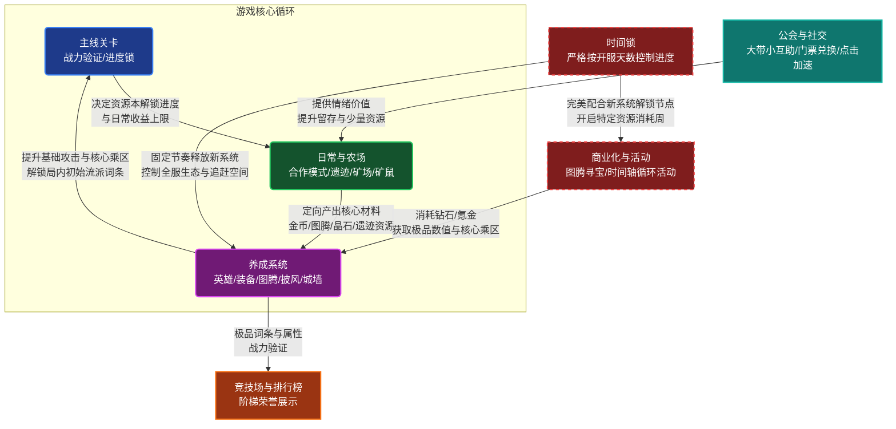

![[永恒的蔚蓝星球.png]]
# 简介
《星球》是一款核心玩法为局内轻度肉鸽+塔防，通过金币召唤英雄，相同星等的英雄随机合成更高等级的英雄，消灭敌人来通关；局外长线上引入一套常规rpg系统的休闲策略类游戏。
## 游戏定位

|      |                   |
| ---- | ----------------- |
| 平台   | 移动端 微信/字节/TapTap等 |
| 游戏类型 | 休闲策略              |
| 玩法   | 肉鸽、塔防+rpg         |
| 美术风格 | 卡通可爱              |
| 付费模式 | 主IAP+轻量IAA        |
| 面向人群 | 中轻度玩家，偏男性向策略玩家    |
## 核心循环

# 战斗系统
## 概述
《星球》中的战斗玩法融合了传统的合成塔防和轻量肉鸽随机构筑的玩法设计。局内唯一的资源是银币，通过银币可以召唤英雄或给已召唤英雄添加词条。

从系统设计的角度来看，其单局体验本质上是一个**受控的资源管理模型**。玩家的核心目标，是通过极高频的随机合成操作，将银币转化为最优的输出效率，以此来对抗系统设定的怪物狂潮。
#### 英雄与合成机制

《星球》中的英雄可以类比成传统塔防游戏中的防御塔。玩家在局内消耗银币对其进行召唤和升级，两个相同等级的英雄能够随机合成一个新的更高一级英雄（最高四级）。系统在合成机制上做了以下核心设计：

- **纯随机与伪随机干预：** 每次召唤和合成基本是平均随机。但在主线关卡中内置了防极端运气差的假概率：例如如果第1个合成出的三星英雄不是C位（核心输出），那第2个三星英雄必定是C位。
    
- **局内经济与网格控制：** 开局初始网格仅为 7 个，每进行 5 次有效召唤增加 1 个网格，硬上限为 12 个。银币的获取与怪物数量挂钩，前期极度紧缺，且召唤和购买词条的价格呈阶梯式递增（词条收益高，故价格递增极快）。
    
- **合成顺发机制：** 合成后的英雄能无视CD直接释放一次技能，关键时刻非常有用。

### 职业
![[file-20260312011538012.png]]
英雄具有职业，区别详细见下表：
职业的划分主要是部分攻击方式与范围以及特性的不同，也顺势引出关卡的多样不同职业加成的设计(鼓励并引导玩家培养多职业卡)

| 职业  | 描述                             |
| --- | ------------------------------ |
| 战士  | 近战范围输出，索敌逻辑上优先清理城墙边的小兵         |
| 法师  | 远程魔法输出，主打群体AOE或特定控制机制，承担主要输出位置 |
| 射手  | 远程物理输出，拥有较高的单体攻速               |
| 辅助  | 提供攻速加成，给怪物上debuff              |
| 毒系  | 远程魔法输出，造成范围持续伤害                |
| 召唤  | 召唤额外衍生物作战，分担怪物仇恨               |
| 控制  | 对怪物造成减速，晕眩等辅助buff              |

**词条随机构筑（Rougelike）：** 词条是英雄在局内提升战力乘区最大的一环。每次消耗银币购买词条，系统会从场上现有英雄的专属词条池和公用词条中随机抽取。大招词条被赋予了极高的出现权重。单个英雄通常拥有2条以上的强化路线（例如“暴风”可走裂变伤害的风刃流，或重控制的龙卷风流），这使得同一个英雄在不同关卡中具备极高的复用率。
![[file-20260309230439770.png]]
## 编队
在进入关卡战斗前，玩家需要选择自己的编队，多样的职业选择会给队伍带来属性上的加成。（这里卡史诗及以上品质的英雄也是为了提醒玩家前期不要一直培养低品质的英雄卡。）
![[file-20260312011513543.png]]
游戏提供三个预设编队容量，主要目的是便于玩家针对不同关卡的怪物抗性和职业加成，快速切换对应阵容。

## 怪物与波次节奏

怪物的波次与刷新节奏是控制单局游戏心流体验的核心引擎。

- **中置 BOSS 控场：** 区别于关底打BOSS的常规设计，《星球》的主线BOSS通常在第4波生成，第7波逼近城墙。提前给玩家紧张感，boss的形象、体积都很大，压迫感很足。
    
- **索敌机制的隐形坑点：** 英雄优先攻击BOSS和精英。当BOSS存活并在中央推进时，英雄的火力会被强制吸走，导致两侧的小怪无人清理而疯狂攻击城墙。
    
- **数量指数增长曲线：** 游戏单局（约10波）的难度递增并不依赖怪物血量的线性飙升（首尾血量仅增加约1倍），而是怪物数量的指数级暴增（从十几只激增到上百只）。
    

## 整体设计目的与预期体验

- 核心设计目的：
    
    - 用“受限的网格”和“纯随机合成”包装传统的塔防数值验证，强迫玩家进行资源管理与赌徒式的风险决策，提高长线刷图的耐玩度。
        
    - 波次怪物的指数级增长是为了承接肉鸽玩法后期极度膨胀的AOE伤害乘区；而中置BOSS配合优先索敌机制，则是为了强行检验玩家AOE与单体伤害的成型度。
        
- 预期玩家体验
    营造典型的高情绪方差心流：松（前3波平缓攒阵容） -> 紧（4至7波BOSS压迫，伴随合不出C位的挫败感与疯狂赌词条的紧张感） -> 松（8波后成型，享受几下干死满屏怪海的终极割草解压感）。

# 养成系统 

《星球》的养成架构是一个被精确计算过的“齿轮组”。它通过极其克制的“单线深度”和“开服时间锁”，将玩家的短期反馈（基础攻击）与长期深坑（百分比乘区）完美剥离，并用资源卡点（金币）强制驱动玩家的日常活跃。

## 英雄养成机制：单线深度与时间锁

与市面上绝大多数强调“广度收集”（如《AFK》巅峰竞技场需要凑齐15张满练度卡牌）的数值卡牌不同，《星球》走的是深度养成而不是广度养成路线。

- **职业单卡迭代（无冗余设计）：** 同一个稀有度下，一个核心职业通常只有一张卡（例如：红色品质只有战士赵云，橙色品质只有法师闪电之子）。
    
- **绝对的数值碾压：** 新稀有度卡牌在机制和数值上具有绝对统治力。一个刚抽到的高稀有度卡牌，只要养到 10 星左右（月卡党约需 1 周资源），战力就能直接碾压上一代满练度老卡牌。
    
- **开服天数时间锁（Time-Gating）：** 高阶英雄严格按照单服务器的“开服天数”固定解锁（同一职业的下一张卡可能需要等半年）。
    
    - _机制亮点：_ 这种设计限制了超级大R的毕业速度。土豪即使无限氪金，也必须等待系统“版本更新”才能继续养成。这给中微氪玩家提供了巨大的追赶周期和心理缓冲。
        

#### 2. 基础数值引擎：装备系统

装备是支撑玩家前中期推图最核心、反馈最快的系统，也是制造日常资源缺口的“消耗大户”。

- **装备三维属性构成：**
    
    - **基础攻击力（主属性）：** 前期战力占比极高，更换高品质装备能带来百分之几的直接攻击力提升。
        
    - **附加属性（副词条）：** 提供微量的特定属性加成。
        
    - **特效（机制/百分比）：** 提供额外的百分比加成。
        
- **双重养成流向：**
    
    - **洗炼（消耗“洗炼石”）：** 决定装备的附加属性和特效。洗炼石通过分解冗余装备获取，构成自循环。
        
    - **强化（消耗“金币” + “强化卷轴”）：** 这是系统刻意制造的**卡点**。金币的巨大缺口（强化频率高、消耗大）是驱动整个游戏日常活跃的底层动力。
        

#### 3. 核心乘区深坑：图腾系统

如果装备决定了玩家的下限，那么图腾就决定了玩家的最终上限，它是游戏最核心的长线追求和重度商业化出口。

- **孔位与属性：** 一套装备最多可镶嵌 **32 个图腾孔位**。图腾不仅提供高额的“百分比属性加成”（核心乘区），还提供局内关键的“机制效果”（如：局内概率出现暴击格子、概率直接召唤 2 星英雄）。
    
- **7级品质与合成树：** 图腾分为“白、绿、蓝、紫、橙、红、粉”7种品质。合成公式极其苛刻：**4个低品质合成1个高品质**。
    
- **获取周期的深坑：** 白嫖玩家主要依靠日常打工产出（多为白绿品质）。按照合成树计算，想要靠白嫖合出一个最终的粉色图腾，即便每天刷满 20 次日常，也需要数十天的周期。这拉出了极长的游戏寿命。
    

#### 4. 资源中转枢纽：主线与合作模式

游戏巧妙地利用“框架效应”，将最极品的资源获取途径包装得非常“纯洁”。

- **主线关卡（进度控制阀）：** 主线本身的挂机资源产出极低。它的唯一功能是作为**“门槛”**——每通关 10 层，解锁更高爆率的【合作模式】；同时主线层数决定了【星球矿场】（刷金币）和【遗迹夺宝】（刷城墙材料）的每日产出上限。
    
- **合作模式：** 产出极品装备和基础图腾的来源。
    
    - **绝对限次：** 每天系统仅发放 3 张门票，公会每周仅可兑换 7 张。**严禁付费购买门票。**
        
    - _机制亮点：_ 最强的攻击力道具不能直接花钱买，这让玩家产生“游戏良心、不逼氪”的错觉，锁住了极高的长线留存。
        

#### 5. 外围养成：披风与城墙

- **披风系统（绑定社交的时间漏斗）：**
    
    - 经典的海量资源洗炼玩法，目标是刷出 5 个完美词条（纯数值加成，无机制改变）。
        
    - 洗炼消耗的核心资源“晶石”，只能在【矿鼠之家】挂机产出。挂机需要消耗“罗盘”和**大量的现实时间**。为了减CD，玩家必须高频打开公会界面互相点击求助，将单机养成强行绑定为社交粘性。
        
- **城墙系统（机制拓宽）：** 消耗“遗迹夺宝”产出的道具进行升级，主要提供局内的生存容错率与新的机制加成。
    

#### 【养成系统 - 整体设计目的与预期体验】

- **核心设计目的：**
    
    - **避免资源冗余：** 放弃广度图鉴，用“单卡绝对碾压”保证玩家投入的每一分资源都有极高的保值率和战力转化率。
        
    - **构建长效动力链：** 打造了一条完美咬合的驱动链条：**装备强化缺金币 -> 必须打合作模式与金币本 -> 合作模式受主线层数限制 -> 必须提升基础属性推主线**。这套闭环保证了极高的DAU（日活）。
        
    - **拉开付费纵深：** 基础装备面向大众保下限，高阶图腾和极品洗炼面向大R拉上限，通过极大的合成基数（4合1，7个品质）构建无法轻易填满的数值深坑。
        
- **预期玩家体验：**
    
    - **前期（爽快感）：** 每天只需完成极其“良心”的免费合作模式，拿到新装备就能体会到攻击力直观飙升的快感。
        
    - **中期（规划感与粘性）：** 开始感受到金币短缺的压力，每天精打细算地规划“矿场”、“互助点击”和装备强化，形成类似“收菜”的稳定心流。
        
    - **后期（爆点与释放）：** 经过漫长的积累终于合出/抽出高阶图腾，或是等到了时间轴解锁的新稀有度英雄，资源倾泻后感受到战力阶梯式爆发的巨大成就感。

## 社交系统 

《星球》的社交生态刻意弱化了传统MMO中重度的情感社交（如复杂的聊天室、大型GVG公会战），转而采用了一种极其巧妙的做法，不强制要求玩家社交。它的思路是：用微小但必须的利益强行捆绑玩家日常，同时极力克制PvP带来的内卷焦虑。

## 1. 利益捆绑枢纽：公会与互助生态

公会是游戏内最大的社交活跃度来源，系统通过三大“强制性”互助机制，将不同阶层的玩家连接在一起。

- **唯一性资源兑换（合作门票）：**
    
    - **机制流转：** 玩家通过极其轻度的日常行为（签到、微量金币捐献）获取公会代币。公会商店是全游戏**额外获取“合作模式门票”的唯一稳定出口**（每周限换 7 张）。
        
    - **底层逻辑：** 由于【合作模式】是游戏核心养成（装备/图腾）的命脉，且严禁充值购买门票，这就强制所有试图长线玩下去的玩家必须加入公会并保持基础活跃。
        
- **跨阶层共生（合作模式“蹭车”）：**
    
    - **机制流转：** 高战力大R每天的免费门票（3张）远远不够刷极品图腾，他们必须去“蹭”其他中低氪玩家建房的门票；而低战力玩家打不过高收益的高层合作，必须依赖大R的“带飞”。
        
    - **底层逻辑：** 极其高明的生态设计。它完美解决了大R玩家的“情绪价值”需求（享受带人割草的虚荣感），同时平滑了低氪玩家的前期卡点，形成了完美的阶层共生。
        
- **高频异步交互（矿鼠之家加速）：**
	披风养成所需的“晶石”强依赖现实时间挂机。玩家发起求助后，公会成员点击可大幅缩减挂机时间（获取微量友情点）。
	为了让自己的资源早点产出，玩家会养成打开公会界面“帮别人点一下”的习惯，极大地拉升了游戏在后台的唤醒率和UI界面的点击频次。

## 2. 被弱化的战力验证：竞技场 

在常规的商业化卡牌中，竞技场排名是榨干大R钱包的主要手段，但在《星球》中，这套系统被刻意地降低权重。

- **验证维度（异步防守）：** 采用常规的异步镜像对战，将局外英雄养成的深度带入到对局中；不过区别于《皇室战争》，高等级与低等级的卡牌的数值差距足以弥补运气和操作的差距。
    
- **反内卷的奖励投放：**
    
    - 竞技场的排名奖励和日常产出设定得并没有那么多，并不投放具有垄断性的核心资源。
        
    - **底层逻辑：** 这是一个极其克制的长线留存保护机制。因为游戏最核心的付费深坑在于“合作模式的图腾”和“时间轴运营活动”，如果竞技场的奖励压迫感过强，会导致占全服 90% 以上的中低氪玩家产生严重的“数值内卷焦虑”从而快速流失。保持PvP奖励的鸡肋化，是为了维护大盘生态的健康存活率。

#### 社交系统 - 整体设计目的与预期体验

- **核心设计目的：**
    
    - **打造阶层稳态：** 摒弃“大R杀穿平民”的仇恨驱动，采用“大R借票，平民借力”的互助驱动。用极其良性的合作模式，保证大R有炫耀的舞台，平民有大腿可以抱，降低服务器流失率（如文章所述，加了100个好友只流失40个，留存极高）。
        
    - **粘性控制：** 用“矿鼠点击”和“公会商店门票”强制制造每日的上线打卡点。
        
    - **控制付费焦虑：** 弱化竞技场收益，防止微氪玩家因PvP挫败感而退坑，将付费痛点精准转移到PVE养成（主线卡关与图腾深坑）上。
        
- **预期玩家体验：**
    
    - 日常体验是一种互惠互利的“温水煮青蛙”式的和谐感。微氪玩家抱大腿通关高级合作模式时会有“白嫖高收益”的爽感；大R玩家则能在带人的过程中，获得被需要的成就感与数值碾压的炫耀感。
        
    - 没有传统公会战按时打卡的重度逼肝压力，只有随上随点、各取所需的轻度社交粘性。
## 活动与付费系统

《星球》的商业化架构极其成熟。它放弃了早期卡牌游戏那种“充钱直接给VIP等级和固定数值”的买卖，转而采用**“严格的时间轴控制（滚服活动）”**结合**“重度随机抽奖”**，把付费点深埋在养成系统的解锁节奏中。

## 核心敛财骨架：时间轴循环活动 

这是目前大部分中度出海/小游戏最核心的运营框架。游戏的活动不按自然日历（如五一、国庆）开启，而是**严格按照单服务器的“开服天数”依次轮换**。

- **精准的节奏收割：** 养成系统在第 X 天解锁了“图腾”，运营活动就会在第 X 天精准开启“图腾寻宝周”；解锁了“披风”，就跟上“晶石消耗周”。
    
- **机制流转：** 在特定活动周内，玩家消耗对应的养成资源（如寻宝券、晶石）达到指定档位，可以获得极高性价比的返利和稀有道具。
    
- **底层逻辑：** 这种“滚服”机制完美契合了养成系统的“时间锁”。它让每个新服的玩家都处于被系统精心编排好的付费节奏中，每隔几天就有一个小爆发点，通过不断的短期目标（囤资源 -> 等活动周 -> 倾泻资源拿奖励）刺激玩家持续活跃和冲动消费。
    

## 终极吸金黑洞：大型月度活动

游戏每个月会开启一次与其开服天数相匹配的大型综合运营活动，这是全游戏产出最好外观（国王皮肤、武器皮肤、极品坐骑）的地方，也是洗大R玩家最狠的系统。

- **组合拳机制：** 活动通常包装成一个大合集，包含：30日签到（保底活跃）、免费每日抽奖（拉留存）、特殊战令（中微氪）、不重复的抽奖玩法，以及最核心的**“花钻石抽代币换皮肤”**。
    
- **代币抽奖池 (Gacha)：** 每次活动的奖池随养成进度变化。玩家需要用钻石或直购礼包获取抽奖道具，抽取活动代币，再用代币去兑换极品皮肤和核心机制道具。
    

## 随机付费的心理学陷阱：中氪痛点

《星球》的重度付费点（图腾寻宝、月度外观抽取）几乎全部采用了强随机性（RNG）设计。

- **阶层体验分化：**
    
    - **零氪/微氪党：** 心态极好。只拿系统送的免费抽奖次数，随缘参与，勉强跟上大部队进度即可，反而觉得游戏送得多、“很良心”。
        
    - **重氪大R（土豪）：** 无视概率波动。用无限的资金强行“充满”（触碰硬保底或搬空奖池），获取绝对的数值统治力和极品外观展示。
        
    - **中氪玩家的“受难”：** 这是随机付费机制下最惨的群体。他们花了一定数量的钱，却因为概率波动（运气差）导致收益甚至不如运气好的零氪玩家，从而产生巨大的挫败感和怨言（甚至流失）。
        
- **底层逻辑：** 尽管这种设计会伤害部分中氪玩家，但从商业化大盘来看，这是目前把“付费深度拉到极高”且“最不伤平民玩家留存”的最优解。流失少数运气不好的中氪，换来的是极高的基础DAU和头部大R的无限付费上限。
    

##  常规商业化补充

- **月卡与战令（细水长流）：** 提供每日钻石产出与局内特权（如免除部分日常玩法的扫荡CD），通过极高的性价比锁定玩家的长期留存（沉没成本）。
    
- **触发式弹窗礼包 (BPU)：** 当玩家首次卡关、解锁新英雄或合成出高阶图腾时，系统会精准弹出限时折扣礼包，利用“倒计时”制造紧迫感，收割玩家当下的冲动消费欲望。
    

## 活动与付费系统 

- **核心设计目的：**
    
    - **榨取沉没成本：** 用“滚服活动”培养玩家“囤资源等活动”的习惯，一旦玩家开始为了下一个周活动囤积道具，他就极难流失。
        
    - **价格歧视与分层收割：** 通过月卡战令收割底层月费；通过强随机抽奖和无底洞般的“图腾/皮肤”系统，精准且不设上限地洗出大R的钞票。
        
    - **隐藏逼氪感：** 核心的数值验证（合作模式）不卖门票，把最狠的氪金点包装在“外观（皮肤）”和“活动概率（抽奖）”里，维持表面上的生态平衡。
        
- **预期玩家体验：**
    
    - **日常阶段：** 囤囤鼠的快乐。每天算计着手里的资源，看着攻略规划下周该投入什么活动，充满期待。
        
    - **爆发阶段：** 在月度活动或特定资源周倾泻资源时，感受到战力狂飙的爽感；但在面对极其坑爹的随机抽奖时，也会体验到“上头”冲动消费或“非酋”的懊恼。

