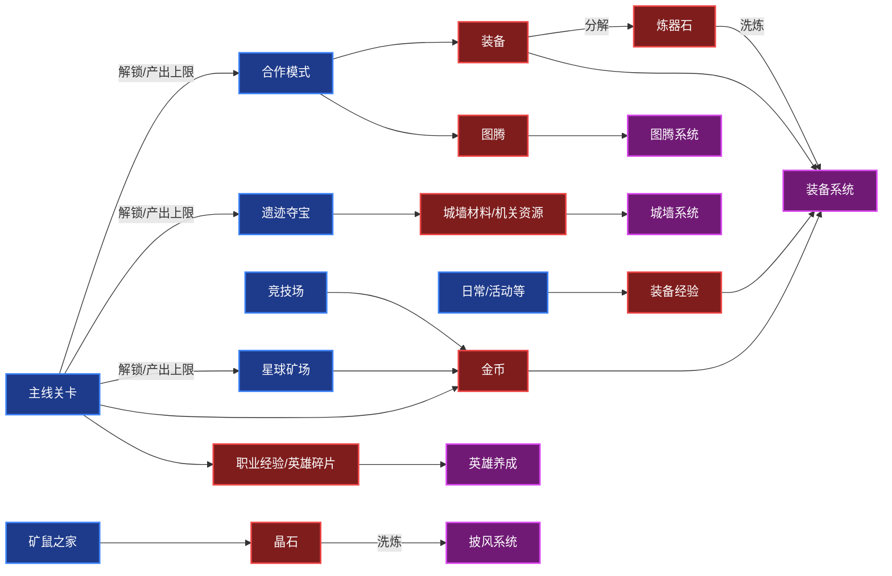
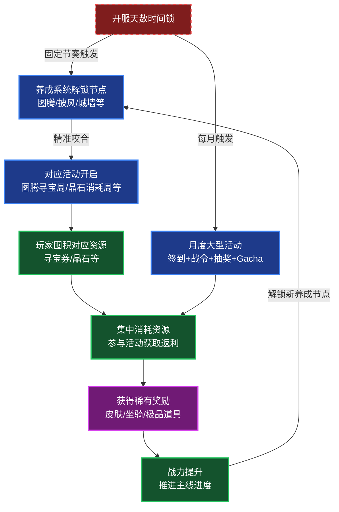
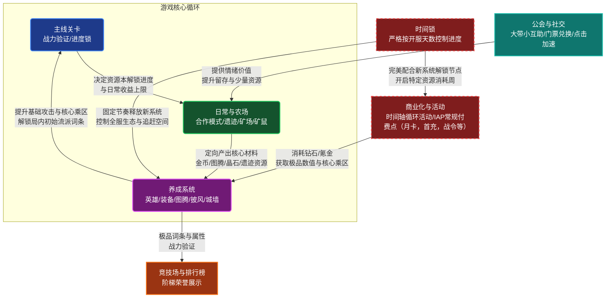

![[assets/《永恒的蔚蓝星球》拆解与体验报告/永恒的蔚蓝星球.png]]
# 简介
《永远的蔚蓝星球》是一款以局内轻度肉鸽塔防为核心、局外长线养成为驱动的策略塔防手游。
**局内体验：** 英雄合成随机与词条随机的双层叠加产生峰值爽感，低代价失败机制保护留存。

**资源循环：** 装备强化持续消耗金币→驱动玩家每日刷合作模式→合作模式受主线层数限制→推动玩家持续推图养成，形成闭环。

**活动循环：** 活动按开服天数依次解锁，与养成系统解锁节奏精准对齐——新系统解锁时对应消耗活动同步开启，培养玩家"囤资源→等活动→集中消耗"的长线活跃习惯。
#资源循环图

#活动循环图

## 游戏定位

| 平台   | 移动端 微信/字节/TapTap等 |
| ---- | ----------------- |
| 游戏类型 | 休闲策略              |
| 玩法   | 肉鸽、塔防+rpg         |
| 美术风格 | 卡通可爱              |
| 付费模式 | 主IAP+轻量IAA        |
| 面向人群 | 中度玩家，偏男性向策略玩家     |
## 核心循环

# 核心体验与情绪
《星球》最核心的体验，来自两层随机的叠加效应——**英雄合成的随机**与**词条选择的随机**。两者单独作用时体验平淡，但当两者同时趋向理想状态时，会产生明显的峰值爽感。

这种设计的本质是让单局体验呈**正态分布**：有高峰、有平淡、也有低谷。低谷的存在不是缺陷——没有连续随不出主C的挫败感，就不会有合出4级主C瞬间逆转局面的成就感。两者相互定义，峰值体验的强度由低谷的深度来撑托。

以笔者的实际游玩体验为例：某局以法师"闪电之子"为主C，前中期召唤偏向主C且词条方向顺畅，在Boss"红桃皇后"出现时已积累4个词条；但Boss带来的怪物压力仍然很大，走到城墙前时还有半管血，局面并未解决。此时恰好合出第二个4级主C，词条累积至6个，伤害剧增，直接秒杀Boss，场面压力瞬间释放，随后宝箱出现，成就感集中爆发——这正是两层随机同时趋向极值时产生的典型峰值体验。

反过来，当两层随机持续背离时——召唤不出主C、词条方向混乱——单局几乎没有翻盘空间，结果通常是直接失败。但由于失败的代价只是消耗体力，挫败感被有效控制在可接受范围内，不足以驱动玩家流失，只会驱动玩家重开再赌。

**这套机制的精妙之处在于：它用可控的低代价失败保护了留存，同时用随机峰值体验维持了长线的游玩动力。**

# 目标规划与节奏

**BOSS节奏**

《星球》的BOSS在第4波就出现，第7波逼近城墙，这与大多数塔防游戏"BOSS压轴"的设计思路截然不同。这种前置设计带来的核心体验是：玩家在局内build尚未成型时就需要面对压迫感，形成"松-紧-松"的情绪节奏——前3波建立基础阵容，第4至7波在BOSS逼近的压力下加速构筑，击杀BOSS后进入相对轻松的收尾阶段。

值得注意的是，《星球》有局外养成要素，这让BOSS节奏比纯单机肉鸽更加复杂——即使词条方向选对，数值不足同样可能导致失败。这意味着BOSS关的压迫感不只来自随机性，也来自玩家的养成进度，形成了一个天然的付费与留存驱动点。

缺点也很明显：BOSS出现时局内build往往还没达到最完美的状态，击杀BOSS时的爽感爆发不足，这是这套设计需要承受的代价。

**难度曲线**

《星球》的难度递增依赖的不是怪物血量的线性飙升，而是怪物数量的指数级暴增——首尾关卡的怪物血量仅增加约1倍，但数量从十几只激增到上百只。这个设计选择直接决定了单局的核心爽感：build完成后能够一次清掉大批怪潮，而不是费力啃掉几只血厚的怪物。数量堆叠制造了视觉上的压迫感，也放大了build成型后的割草快感，两者相互强化。

波次内部也有细分节奏——前3波每波分2小段，后7波每波分3小段，这让难度递增更加平滑，避免了单波内怪物一次性涌入造成的节奏失控。

**银币与格子节奏**

前期银币极度紧缺，召唤英雄与购买词条之间的资源竞争构成了单局最核心的决策张力。由于词条收益远高于单个英雄的战力提升，购买词条的价格递增极快，这进一步压缩了玩家的操作空间，让每一枚银币的分配都具有实质意义。

格子数量的限制则制造了另一层博弈：初始7个格子，每召唤5次增加1个，硬上限12个。这个设计强迫玩家在"保留主C"和"合成解锁格子"之间做出取舍——有时候明知是主C也必须合掉，这种被迫放弃的设计恰恰强化了随后合出高级主C时的成就感。
# 战斗系统
## 概述
《星球》的战斗玩法融合了传统合成塔防与轻量肉鸽随机构筑。局内唯一的资源是银币，通过银币召唤英雄或为英雄添加词条。单局体验本质上是一个**受控的资源管理模型**——将银币转化为最优的输出效率，在中后期形成**割草爽感**。
## 英雄
《星球》中的英雄可以类比成传统塔防游戏中的防御塔。玩家在局内消耗银币对其进行召唤和升级，两个相同等级的英雄能够随机合成一个新的更高一级英雄（最高四级）。
### 合成机制

- **纯随机与伪随机干预：** 召唤和合成基本是平均随机，但内置了防极端运气差的假概率——如果第1个合成出的三星英雄不是C位，那第2个三星英雄必定是C位。伪随机保护了玩家的体验下限，让运气差的时候也能维持在可接受范围之内。
- **合成顺发机制：** 合成后的英雄能无视CD直接释放一次技能，合成在大多时候都是负收益的操作，转化成一次即时的技能释放也降低了这个负收益。

![[assets/《永恒的蔚蓝星球》拆解与体验报告/file-20260318225529387.png]]

PS:可以说《星球》的肉鸽要素有少部分就体现在英雄的随机合成上，玩家需要与**随机系统**博弈的点在于**随机召唤**和**随机合成**，何时选择承担合成主C（拥有大多数词条强化）后合成出其他输出羸弱的角色的风险来解锁更多网格，提升上限。
### 职业

职业的划分主要体现在攻击方式、范围与特性的不同，结合关卡的职业加成设计，引导玩家培养多职业英雄。

| 职业  | 描述                             |
| --- | ------------------------------ |
| 战士  | 近战范围输出，索敌逻辑上优先清理城墙边的小兵         |
| 法师  | 远程魔法输出，主打群体AOE或特定控制机制，承担主要输出位置 |
| 射手  | 远程物理输出，拥有较高的单体攻速               |
| 辅助  | 提供攻速加成，给怪物上debuff              |
| 毒系  | 远程魔法输出，造成范围持续伤害                |
| 召唤  | 召唤额外衍生物作战，分担怪物仇恨               |
| 控制  | 对怪物造成减速，晕眩等辅助buff              |
### 词条
词条是英雄局内提升战力乘区最大的一环。每次消耗银币购买词条，系统会从场上现有英雄的专属词条池中随机抽取，大招词条被赋予了极高的出现权重。

单个英雄通常拥有2条以上的强化路线（例如"闪电之子"可走链条伤害的电流流，或重AOE的电球流），使同一个英雄在不同关卡中具备极高的复用率。多路线设计背后有两个原因：一是为局外养成的固定词条解锁留出空间，单一路线会堵死这个设计；二是不同路线在主线本和活动本中各有强势场景，增加了英雄的使用弹性。
价格递增（100→200→400→800→1000→1500）让前期词条性价比极高、后期每个词条都是重大决策，与单局后期银币紧缺的节奏形成咬合。看广告刷新是一次低成本容错机会——避免玩家被迫选废词条，同时限制只用一次，不破坏付费生态。
![[assets/《永恒的蔚蓝星球》拆解与体验报告/file-20260309230439770.png]]
## 编队
进入关卡前，玩家需要选择编队，多样的职业组合会带来属性加成。
![[assets/《永恒的蔚蓝星球》拆解与体验报告/file-20260312011513543.png]]
游戏提供三个预设编队容量（史诗以上），主要目的是便于玩家针对不同关卡的怪物抗性和职业加成，快速切换对应阵容。
![[assets/《永恒的蔚蓝星球》拆解与体验报告/file-20260312011538012.png]]
## 怪物
### 类型
怪物分为肉盾怪、高速怪、远程怪、飞行怪、普通怪五种，各有特性。另一个维度是对特定职业的克制关系，特性与职业克制共同构成怪物的属性搭配，每个关卡通过更换怪物组合和属性加成驱动玩家调整阵容。
![[assets/《永恒的蔚蓝星球》拆解与体验报告/file-20260318232314364.png]]
### 波次节奏

怪物的波次与刷新节奏是《星球》控制单局游戏心流体验的关键要素。
英雄的索敌优先攻击BOSS和精英。当BOSS存活并向中央推进时，英雄火力被强制集中，导致两侧小怪无人清理——这在局面紧张时会构成额外压力。
需要细致说明的是怪物每一波次内也存在细分的刷怪节奏，本人估计下来前三波每波又细分成两小段，而对于后7波来说是细分成三小段。这个刷怪波次节奏构成了类似**幸存者类**游戏中肉鸽build到中后期难度上升体验，达成近似完美构筑之后的大批怪潮也能满足割草的爽感。
另外一点是，Boss在中期出现这一设计有好有坏，优点是从中期boss出现开始就能调动玩家的情绪，给予压力，不像前中期全程打小怪和精英那么无趣。缺点是往往boss出现或死亡时局内build往往没有达到最完美的状态，爽点爆发不足。
                      ![[assets/《永恒的蔚蓝星球》拆解与体验报告/file-20260318231532986.png]]
而《星球》对精英和boss死亡之后添加的又一层正反馈是宝箱奖励，呈现的界面是老虎机界面，能获得银币或随机词条奖励。
                                ![[assets/《永恒的蔚蓝星球》拆解与体验报告/file-20260318231720828.png]]
                                ![[assets/《永恒的蔚蓝星球》拆解与体验报告/file-20260318232153361.png]]
这一设计延长了击杀boss之后带给玩家的爽感体验，并以银币或词条这种可视化的奖励与之后进一步召唤或强化英雄形成了正反馈循环。
## 关卡设计结构
### 关卡节奏
《星球》中的主线关卡设计是每五关一个boss关，其他关卡中把boss替换成精英。且每五关间都会出现一定的养成数值卡点，即养成度不够大概率是通不过boss关的。值得一提的是《星球》的养成体验还算不错，所以并不会很劝退，反而成为区分小中大R战力与推图速度的一个分水岭。
![[assets/《永恒的蔚蓝星球》拆解与体验报告/file-20260318232233549.png]]
### 关卡属性
大部分关卡都带有一定属性（加成和限制某些职业的英雄），且这关的怪物都是克制被限制的职业，被加成的职业克制的。
![[assets/《永恒的蔚蓝星球》拆解与体验报告/file-20260318232253800.png]]
PS：《星球》的单局结构之外建立的这些内容（如英雄职业，怪物特性，关卡属性加成等）都是在玩法上的扩展，理论上是可以在基本系统上无限叠加，交替出现的，这些设计也是带给玩家新鲜感体验的一大要素。
# 玩法模式

《星球》的局外内容围绕一条核心逻辑展开：**主线关卡决定资源本的解锁进度，资源本决定养成材料的产出上限**。各玩法模式并非独立存在，而是通过资源的定向产出与消耗形成相互咬合的驱动关系。

                                            资源循环图
## 主线关卡

主线是整个游戏的进度控制阀，本身的挂机产出极低（钻石、金币、职业经验），核心价值在于解锁后续内容——每通关10层开放更高爆率的合作模式，同时决定星球矿场和遗迹夺宝的每日产出上限。

每五关设置一个BOSS关作为养成卡点，养成度不足大概率无法通过。这个设计既是付费转化点，也是区分不同氪金层级玩家推图速度的自然分水岭。
## 合作模式
![[assets/《永恒的蔚蓝星球》拆解与体验报告/file-20260319012818053.png]]
![[assets/《永恒的蔚蓝星球》拆解与体验报告/file-20260319012839982.png]]
合作模式是全游戏最核心的资源产出渠道，产出极品装备和基础图腾。每天系统发放3张门票，公会每周可额外兑换7张，**严禁付费购买门票**。

双人合作的机制设计天然形成了大R带小的生态——高战力玩家帮低战力玩家通过高层合作本，双方各取所需。这个模式的详细分析见社交系统章节。

## 日常资源

**星球矿场：** 基础金币来源，每日限次，产出上限受主线层数控制。金币是装备强化的核心消耗，缺口持续存在，是驱动玩家日常活跃的底层动力。
![[assets/《永恒的蔚蓝星球》拆解与体验报告/file-20260319012948388.png]]
**遗迹夺宝：** 产出城墙升级专属材料，同样受主线层数限制，每日固定次数，且每日有一个随机职业加成与失败次数，让战力低的玩家也能获得一定的奖励。
![[assets/《永恒的蔚蓝星球》拆解与体验报告/file-20260319013041069.png]]
**矿鼠之家：** 放置挂机玩法，消耗罗盘开启，产出披风洗炼所需的晶石。挂机时间可通过公会成员互相点击求助来缩减，将资源产出与社交行为强制绑定。
![[assets/《永恒的蔚蓝星球》拆解与体验报告/file-20260319013056776.png]]
## 竞技场

采用异步镜像对战，将局外养成深度带入PVP验证。与多数商业化卡牌游戏不同，《星球》的竞技场奖励被刻意压低，不产出核心养成资源（常规只给金币资源）。

这是一个主动的设计取舍：竞技场排名压力过强会驱动中低氪玩家产生数值内卷焦虑，加速流失。把PVP奖励保持在"有但不重要"的水位，既保留了荣誉展示功能，又把付费压力集中在PVE养成链条上。

# 养成系统

## 概述

《星球》的养成走的是**深度**养成路线——同一职业在同一稀有度下只有两三张甚至一张卡，新稀有度卡牌数值上具有绝对统治力，高阶英雄按开服天数固定解锁。这套设计让每一分资源投入都有清晰的战力转化，避免了广度养成下资源分散、收益模糊的问题。

## 英雄养成

与多数数值卡牌强调广度收集不同（如《AFK》巅峰竞技场需要凑齐15张满练度卡牌），《星球》每个稀有度下一个核心职业只有一张卡，新稀有度卡牌养到10星左右就能直接碾压上一代满练度老卡——对月卡党来说大约一周的资源。

高阶英雄按开服天数固定解锁，同一职业的下一张卡可能需要等半年。这个设计卡住了大R的毕业速度，土豪无论氪多少钱都必须等时间，中低氪玩家因此拥有相对稳定的追赶周期。

![[assets/《永恒的蔚蓝星球》拆解与体验报告/file-20260318233838106.png]]

英雄升级消耗职业经验和英雄碎片，每5级解锁一个新词条。职业经验通过日常关卡稳定产出，英雄碎片则依赖招募抽取——两种资源的获取难度差异，本身就构成了一个隐性的付费分层。

## 装备系统

装备是前中期战力提升最直观的系统，也是金币消耗最大的出口。玩家有项链、铠甲、戒指、皇冠、号角、靴子六个部位。

![[assets/《永恒的蔚蓝星球》拆解与体验报告/file-20260318235200477.png]]

每件装备的核心属性是基础攻击力，随强化等级提升，前期换一件高品质装备能带来百分之几的直接攻击力提升，反馈非常即时。强化消耗金币和装备经验，金币的持续缺口是驱动玩家每日刷合作模式和矿场的底层动力。

![[assets/《永恒的蔚蓝星球》拆解与体验报告/file-20260318234256505.png]]

洗炼词条绑定的是**部位**而非装备本身——这个设计细节值得注意。玩家更换更高品质的装备时，洗炼词条不会丢失，消除了"升级装备会损失洗炼投入"的顾虑，降低了追求高品质装备的心理成本。洗炼消耗炼器石，通过分解冗余装备获取，形成自循环。

![[assets/《永恒的蔚蓝星球》拆解与体验报告/file-20260318234304220.png]]

## 图腾系统

图腾镶嵌在装备槽位上，每个部位最多5个槽位，提供百分比属性加成和局内机制效果（如概率出现暴击格子、概率直接召唤2星英雄）。如果说装备决定了玩家的攻击下限，图腾就决定了最终上限。

![[assets/《永恒的蔚蓝星球》拆解与体验报告/file-20260318235533466.png]]

图腾分白、绿、蓝、紫、橙、红、粉7种品质，4个低品质合成1个高品质。这个合成树设计的深坑逻辑在于：品质越高所需的基础图腾数量呈指数级增长——合出一个粉色图腾理论上需要4的6次方即4096个白色图腾。日常产出以白绿品质为主，这意味着即使每天刷满合作模式，追求顶级图腾也需要数十天乃至更长的周期，拉出了极长的游戏寿命。

![[assets/《永恒的蔚蓝星球》拆解与体验报告/file-20260318235605477.png]]

## 城墙

城墙提供局内的生存容错率与机制加成，有四个槽位可以放置机关。机关通过城墙页面的专属抽卡获取，抽卡资源和城墙升级材料均来自遗迹夺宝模式——这使得遗迹夺宝成为一个目标明确的专属资源本，玩家有清晰的动力每日完成。
![[assets/《永恒的蔚蓝星球》拆解与体验报告/file-20260319064718308.png]]
## 披风
![[assets/《永恒的蔚蓝星球》拆解与体验报告/file-20260319064804511.png]]
## 分析

《星球》养成系统真正精妙的地方，不在于某个单独系统的设计，而在于各系统之间形成的紧密驱动链条：装备强化消耗金币→金币缺口驱动玩家刷合作模式与矿场→合作模式受主线层数限制→主线推进需要养成数值支撑。每个系统的资源缺口都指向下一个需要完成的玩法，整条链条自我咬合。

合作模式严禁付费购买门票这个设计细节值得单独说——最强的战力产出渠道不能直接花钱买，玩家感知到的是"游戏良心"，实际上付费压力被精准转移到了图腾深坑和时间轴活动上。短期反馈（装备攻击力提升）与长期深坑（图腾合成树）的剥离，让不同付费层级的玩家都能在自己的节奏里找到推进感。
# 社交系统

《星球》的社交设计思路是：**用资源利益把玩家捆绑在一起，而不是用义务**。没有重度公会战、没有强制打卡，但每个玩家都在资源需求上依赖其他玩家。

## 公会
![[assets/《永恒的蔚蓝星球》拆解与体验报告/file-20260319064900552.png]]
公会商店是全游戏额外获取合作模式门票的唯一稳定出口，每周限换7张。玩家通过签到、捐献等轻度日常行为积累公会代币换票。这个设计的关键在于：合作模式是装备和图腾的核心产出渠道，门票又严禁付费购买——所有想长线玩下去的玩家，不管氪不氪金，都必须加入公会并保持基础活跃。公会活跃度的驱动力不来自情感社交，而来自资源需求。
![[assets/《永恒的蔚蓝星球》拆解与体验报告/file-20260319064918512.png]]
高战力玩家每天只有3张免费门票，远不够刷极品图腾，必须去蹭其他玩家建房的门票；低战力玩家打不过高层合作本，需要大R带飞才能获取更高阶资源。两边都有明确需求，合作模式把这两种需求精准对接——大R获得被需要的成就感，低氪玩家得到超出自身战力的资源收益，形成稳定的阶层共生。

披风洗炼依赖矿鼠之家挂机产出的晶石，挂机CD可以通过公会成员点击求助来缩减。这个设计把纯单机的养成行为转化成了每日高频的社交互动——玩家为了让自己的资源早点产出，会主动帮别人点击，同时等别人帮自己点。是《星球》提升日活和后台唤醒率最隐蔽的机制之一。

## 招募频道

招募频道是社交系统里设计最有针对性的模块。有合作票的队长在频道内发起招募，其他玩家看到后直接申请加入，本质上是在解决合作模式的匹配效率问题。没有招募频道的话玩家只能在公会内部组队，受限于公会规模和在线人数；招募频道把匹配范围扩展到跨服，让有票的队长能更快找到队员，也让低战力玩家有更多机会找到大R带飞。它是合作模式跨阶层共生生态能够正常运转的基础设施。
![[assets/《永恒的蔚蓝星球》拆解与体验报告/file-20260319064947048.png]]
## 竞技场与排行榜

竞技场采用异步镜像对战，排名奖励被刻意压低，不产出核心养成资源。保持PvP奖励"有但不重要"，既保留了荣誉展示功能，又把付费压力集中在PVE养成链条上，避免中低氪玩家因数值差距产生内卷焦虑而流失。
![[assets/《永恒的蔚蓝星球》拆解与体验报告/file-20260319065002255.png]]
排行榜设计了一个点赞机制：所有玩家每天可以点赞10次，每次点赞赠送200金币。这个设计同时解决了两个问题——对点赞者来说，每日2000金币的收益提供了足够动力让玩家主动打开排行榜；对被点赞的大R来说，点赞数的积累构成了一种可量化的社区认可。用一个低成本的资源奖励，把"看排行榜"这个被动行为转化成了每日主动的互动习惯。
![[assets/《永恒的蔚蓝星球》拆解与体验报告/file-20260319065012780.png]]
## 好友与个人名片

个人名片在排行榜、公会信息、好友列表等场景下可见，展示头像、头像框、聊天气泡等外观。这些外观不提供战力加成，核心价值是身份标识——让大R的投入有可见的展示出口。
![[assets/《永恒的蔚蓝星球》拆解与体验报告/file-20260319065035732.png]]
好友系统每日可以向10个好友赠送礼物，礼物从随机奖励池抽取。这个设计提供了一个低门槛的每日互动理由，维持好友关系的活跃度，同时也是少量资源的补充来源。
![[assets/《永恒的蔚蓝星球》拆解与体验报告/file-20260319065047960.png]]
## 总结

《星球》社交系统的各个模块分别对接了不同的玩家需求：公会机制解决资源获取效率、招募频道解决合作匹配效率、竞技场和名片系统解决大R的展示需求、好友互赠维持轻度社交粘性。没有一个模块是纯粹的情感社交，每一个都和资源或留存挂钩——这是《星球》在不强制社交的前提下维持高留存率的核心设计逻辑。
# 活动系统

![[assets/《永恒的蔚蓝星球》拆解与体验报告/file-20260319063459161.png]]

《星球》的活动不按自然日历开启，而是严格按照单服务器的开服天数依次轮换。这套滚服机制最核心的设计在于：活动开启节点和养成系统的解锁节奏精准咬合——图腾系统在第X天解锁，图腾寻宝周就在第X天开启；披风系统解锁，晶石消耗周紧跟着出现。把活动变成养成系统的一部分，而不是独立于游戏之外的运营事件。

滚服机制让全服玩家的进度高度同步，活动开启时绝大多数玩家都处于能参与的养成阶段。即使是不看攻略的新手，只要保持活跃、克制消费，也能自然踩上活动节奏——以笔者自身为例，前期因为不清楚资源的最优消耗时机而屯下了六千多钻石，在元宵节活动开启时恰好有足够的资源参与，通过活动转盘、战令和任务获得了坐骑和表情等奖励，有明显的爽感和成就感。

![[assets/《永恒的蔚蓝星球》拆解与体验报告/file-20260319063548388.png]]

每个月还会有一个与开服天数匹配的大型月度活动，是全游戏产出最好外观的地方。活动本身的结构是固定的——30日签到、每日抽奖、战令、不重复抽奖玩法和信箱——但每次的奖池包装会随当前养成进度变化。比如这个月恰好解锁了坐骑系统，奖池里就会出现坐骑。内容固定降低了运营成本，包装随进度变化保证了每次活动对玩家来说都有新鲜感和针对性——玩家看到奖池里的东西，刚好就是自己当前最需要的。

因为活动节奏固定且可预期，游戏社区里出现了详细的"开服攻略"，告诉玩家哪天该囤什么资源、哪天该集中消耗。这培养了一批高活跃的规划型玩家——他们每天上线不只是为了当天的收益，而是为了下一个活动节点做准备，是长线留存的核心群体。

活动里的随机付费设计把玩家分成了三层：零氪玩家只拿免费资源随缘参与，反而觉得游戏良心；大R无视概率直接充满；最难受的是运气不好的中氪玩家，花了钱收益可能还不如零氪玩家，这部分人是流失风险最高的群体。但从整体大盘来看，这是目前把付费深度拉高同时不伤小氪玩家留存的最优解——运气不好的中氪玩家数量相对有限，损失可控。

# 全文总结

《星球》是一款各系统之间咬合紧密的小游戏。它的成功不依赖某个单一的创新，而在于各系统之间的严密咬合：局内两层随机产生峰值体验、怪物数量指数增长放大割草爽感、养成资源链条驱动日常活跃、滚服活动与养成节奏精准对齐、社交设计用利益而非义务绑定玩家。每一个设计决策都在服务同一个目标——让玩家有足够的动力今天上线，明天还想再来。

它的局限同样清晰：核心玩法的随机性较高，运气差的局几乎没有翻盘空间；随机付费设计对中氪玩家不友好，是潜在的流失风险点。但从整体留存数据来看，这些代价在设计者的预期范围之内。

对系统策划而言，《星球》最值得学习的不是某个具体机制，而是它展示的一种设计思维：**每个系统的存在都有明确的驱动目的，系统之间的资源流动是经过计算的，而不是拼凑起来的。**

---

_参考文章：《游戏分析（十）：玩法类游戏创新的案例》_