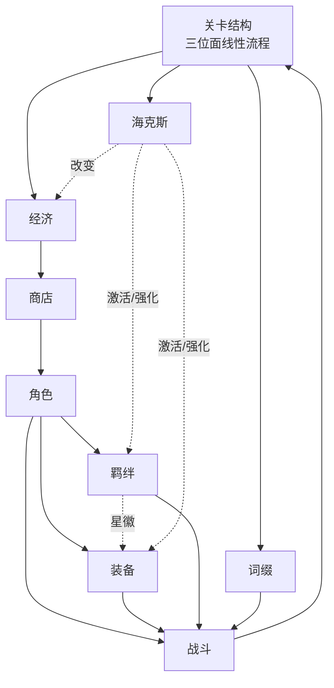
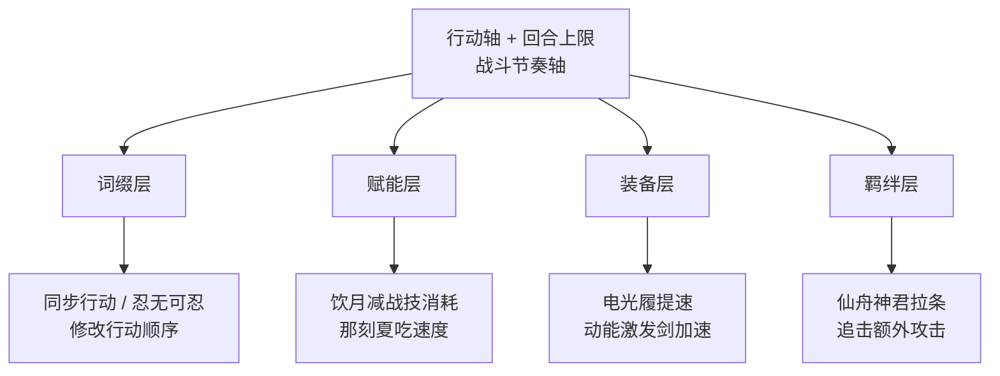

# 《崩坏：星穹铁道》副玩法《货币战争》拆解

## 一、玩法定位

|项目|内容|
|---|---|
|所属产品|《崩坏：星穹铁道》|
|玩法类型|副玩法 / 常驻挑战|
|玩法标签|PVE 自走棋|
|主要参考|云顶之弈 / 金铲铲之战|
|上线版本|3.7（2025.11）|
|体验难度|笔者打到 A8-30|

《货币战争》是一个 PVE 自走棋。经济循环采用类云顶的设计，也有在PVE上做的不同区分设计：难度梯度升级、战斗系统沿用星铁本体的回合制、战斗系统的前后台设计。

## 二、系统骨架

经济、商店、角色、羁绊、装备五层是阵容构筑的主链路。海克斯和词缀横向插入：海克斯由玩家主动选择，词缀由系统被动给定，二者都能跨层修改其它子系统的行为。

**关卡结构**：三个位面线性推进，节点穿插，末尾位面 BOSS。沿用模拟宇宙的线性肉鸽框架。

**经济**：金币来源、消耗、利息、连胜连败补偿全部照搬云顶。但因为对手是关卡而不是其他玩家，运营决策的判断依据被换了——云顶里"几级 D 牌、何时连败"读的是对手，货币战争里读的是开局词缀和位面 BOSS。同一套经济引擎接到了静态题面上，由此衍生出"看词缀决定运营节奏"的固定打法（dot 队 3 级开 D、遐蝶队速上 8 级）。

**商店**：每节点自动刷新一次，可花金币手动刷新或锁定。同费角色的出现概率随玩家等级递增——这条曲线是"几级 D 牌"决策的根源。

**角色**：每个角色有费用（1-5）、星级（1-3）、所属羁绊（2-3 个）、前后台站位、专属"角色赋能"（站对位置才激活）。同费角色共用有限的池子（1-2 星 27 张、3 星及以上 9 张），所以买掉同费的非目标角色能微调目标角色的出现率。未持有的可以试用，已持有的继承本体星魂作为加成层——付费深度只影响顺手程度，不决定能不能玩。

**羁绊**：角色绑定 2-3 个羁绊，达到激活档位触发效果。**星徽**是这一层最有意思的设计：一种特殊装备，让某个角色额外归属一个羁绊。它给了玩家"花装备位换羁绊位"的弹性，解决"开局抽到的角色锁死了能凑的羁绊数"这个 PVE 自走棋的具体问题。

**装备**：简易/进阶/特权三档，单角色最多 3 件。少数装备和特定流派强绑定（绝对热量之于燃血、电光履之于能量、动能激发剑之于追击）。装备更像云顶的"局内随机资源"——拿到什么决定能玩什么 build。

**海克斯（投资策略）**：每局约 4 次三选一+开局初始海克斯。作用层面非常杂——给经济（砂里掏金）、激活 build（钢铁美学之于 6 贝洛伯格）、提供转职（星徽）、强化机制（万箭齐发）。本质是"主动选择 + 被动随机"的混合。

**词缀（投资环境）**：开局给定、整局生效的全局规则修改器。社区把它分成三类：单纯强化某位面或敌人、对部分 build 不利但仍可玩、严重克制特定 build 但对另一些 build 反而利好。第三类是货币战争最有特色的设计——把"负面环境"做成带方向的，识别得对反向利用反而能起飞。

**战斗**：完全沿用本体的回合制——行动轴、属性弱点、击破、能量、战技点全保留。货币战争只加了一层**全场回合上限**：战斗只在两种情况下结束——回合用完，或敌人全清。玩家角色死亡会复活但扣除一定回合数。前台手动操作，后台自动释放技能。

## 三、PVE 难度梯度的解法

|难度来源|云顶之弈（PVP）|货币战争（PVE）|
|---|---|---|
|主要挑战提供方|其他玩家阵容|词缀 + 敌人属性|
|难度变化机制|玩家淘汰自动产生|策划预设组合|
|题面是否动态|是|否（同档位有重复）|
|玩家应对方式|边走边看|开局识别|

PVE 没有 PVP 那种"剩余玩家本身就是难度"的自动机制。如果只靠堆数值，通关条件会退化为"凑齐顶配阵容"——通关一两次后每局目标只剩"再凑一次"，玩法生命周期立刻结束。

货币战争的解法是叠加两个独立题面维度：开局给定的词缀作用整局，直接修改这局适合什么 build；每个位面 BOSS 的属性、抗性、机制各不相同。"反伤词缀"对常规输出阵容是天克、对烧血队反而是利好；"敌人行动后立即拉条"对烧血/盾反/dot 都是好事，对其他阵容很难受。两个维度叠加后，单局题面就不是"我能凑出多强的阵容"，而是"在这个题面下什么阵容能通"。

这把"决定玩什么阵容"的时机前置到了开局。A8 段位的实际体验：开局看到词缀和初始海克斯的瞬间候选 build 就基本定了 1-2 个。拿到持续伤害契约就锁 4dot+4 贝洛伯格；没拿到、第二位面又不出钢铁美学，就放弃 6 贝洛伯格转流派；看到"净化身心"+丰饶玄鹿 BOSS 的组合，桑博 dot 队基本天输，重开比硬玩划算。

代价是词缀的克制力度可以做到无法转型的程度，某些组合是确定性死局。新手前面玩了三十分钟到 BOSS 战才发现没法打、加上单局动辄 30-60 分钟、重开成本很高。官方的攻略推荐系统本质是为识别门槛兜底。

方向上没问题，PVE 自走棋绕不开词缀这一层。但执行偏激进——"识别正确"和"识别错误"之间几乎没有中间地带。3.8 把人力重组从"移除"改成"出售"（保留经济价值）、放宽了决议娱乐星球的转化条件，明显在给"识别错误"的玩家留更多调整空间。

## 四、回合上限与战斗节奏轴

货币战争最聪明的设计在这层。

云顶用加时阶段保证战斗一定结束，回合制没法直接接。货币战争的等价物是给每场战斗加一个**全场回合上限**：回合内全清就赢，超出回合直接扣血。

但这套设计真正聪明的地方不是"超时即败"，而是回合上限被做成了一条**有正向反馈的资源轴**——剩余越多加血越多。回合不只是用来打怪的，是用来攒的。整套战斗的设计空间立刻被打开：

这一批角色赋能、装备、羁绊的设计立足点全在这条轴上。如果没有它，它们就是常规的攻防数值堆叠。玩家社区自创的"胡牌"概念也来自这里——青雀、景元的神君触发本质是把攒下的回合兑换成一次群体伤害。所以战斗里玩家做的不是单纯打怪，是算节奏：每次战技拉条 10%、追击拉条 20%、风套拉条 25%，要算还差多少能胡到下一次神君，但又不能算过头——拉条太快会让青雀提前胡牌、下回合反而空转。

战斗节点的过关结果分三档：未达基础进度线扣大量血、过基础线给少量奖励、全清敌人给更多奖励。但**玩家在战斗中没有止损能力**——战斗只在回合耗尽或敌人全清时结束，角色死亡会复活+扣回合，自杀也无法跳出。所以三档奖惩不是事前的决策选项，而是事后的容错补偿。

它对应的问题是：货币战争多词条叠加 + 角色机制复杂 + 行动轴交互，玩家开战前根本算不准这场能打成什么样，类似炉石酒馆战棋里"看得到对手阵容但算不清能不能赢"的迷雾感。如果只用二元胜负判定，单场打砸就可能整局崩盘；三档奖惩把"输赢"做成了带容错梯度的连续轴，让"算不准"导致的失败不会立刻雪崩。

代价已经是这个玩法最大的问题。算节奏要靠手操——AI 没法判断"差多少能胡到下一次神君"，开自动战斗就把这套深度废了。所以每场战斗都得手操，一局 15 个左右的节点全是完整回合制流程，A8 一局动辄一小时以上，手操量超过普通玩家长期能扛的级别。这里有个无解冲突：算节奏是机制深度的来源、依赖手操；手操又被节点数和回合制时间放大；想用自动战斗解决，又会破坏深度。

A8-30 的实际感受：第一次通关那局成就感很足，但后面再打就开始挑词缀挑环境挑流派，遇到不顺的局直接重开。3.8 没动这件事，4.0 大概率也不会动——动了就要重新设计大量角色赋能。

## 五、副玩法内的角色重构

不重构、直接搬本体角色进货币战争会撞上三个机制层冲突：

|冲突|本体设计|货币战争需求|重构解法|
|---|---|---|---|
|战技点颗粒度|4 人共享，可控|10 人棋盘，会爆炸/死锁|前台按本体逻辑、后台改自动释放|
|角色分工维度|一维（主C/副C/辅助/治疗）|二维（前后台 × 功能）|引入"前后台赋能"机制|
|养成度污染|6 命压制 0 命|策略会退化为氪金度比较|数值按"费用 = 强度"重定|

第三个冲突最直观，重构按费用统一平衡，星魂只作为附加层。社区反复提到的几个关键星魂（2 蝶、2 月、1 万、2 飞）都是"让流派从坐牢变流畅"，而不是"从不能玩变能玩"——这个梯度处理得相当克制。

第二个冲突最值得讲。"前后台赋能"是货币战争硬造出来的机制维度——同一个角色站前台和后台是不同玩法。风堇前台是常规输出、后台变成增益+治疗。这是超出"最小可用"的设计投入：最小方案只需要重新调数值就行，但货币战争给每个角色做了两套技能形态。

代价是维护成本随角色数量线性增长。3.7 上线 61 个角色，按现在版本节奏每年要加 20+，4.0 预告的"专家顾问"机制（部分角色不进商店、要通过对局解锁）实际是在给角色池过载做减法。

## 六、总结

|问题|解法|
|---|---|
|难度梯度（PVP 自然产生的难度被砍掉）|词缀 + 敌人多维属性|
|战局僵化（防御阵容无法终结战斗）|回合上限 + 三档奖惩|
|角色兼容（本体角色塞不进 10 人棋盘）|副玩法内重构 + 前后台赋能|

但这三个机制不是各管各的——词缀里相当一部分直接修改行动顺序，角色赋能大量围绕节奏轴设计，装备和羁绊也参与节奏调度。**词缀、节奏轴、赋能这三层是绑在同一张表上设计的**。三个独立问题被收敛到一套可共享的资源轴上去解决——这是机制设计上最值得学习的地方。

代价是同一套耦合带来的累积复杂度。识别词缀+算节奏+赋能羁绊装备搭配，三层叠加后单局成了一项重任务。这套耦合让任何单点优化都会牵动其他机制——这是货币战争未来真正难解的地方。

---

砍完大概少了 15-20%。如果还有觉得在转的段落直接圈出来，我们再砍。